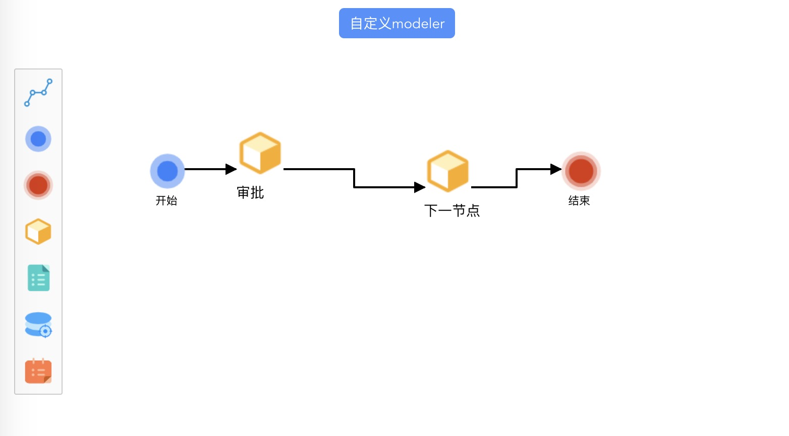

# bpmn-custom-modeler

## 项目描述

此项目为[《封装组件篇》](https://github.com/LinDaiDai/bpmn-chinese-document/tree/master/LinDaiDai/全网最详bpmn.js教材-封装组件篇.md)中的教材案例.


## 项目截图:




## 如何使用

将项目克隆至本地:

```
git clone git@github.com:LinDaiDai/bpmn-custom-modeler.git
```

安装依赖:

```
npm install
```

本地启动项目:

```
npm run serve
```

打包发布至生成环境:

```
npm run build
```

